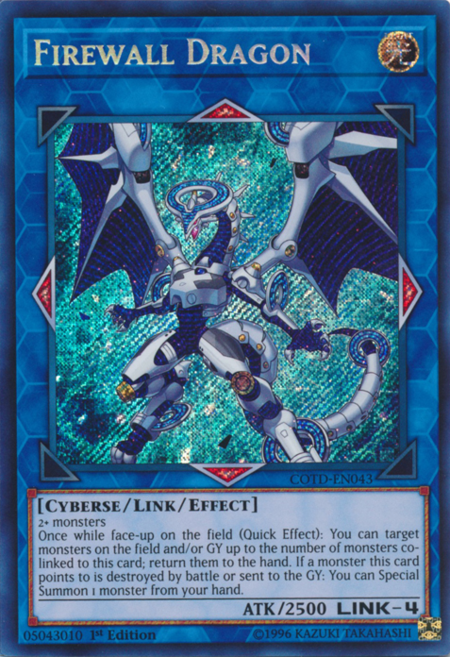

```{r setup, include=FALSE}
knitr::opts_chunk$set(echo = TRUE, fig.align = "center")
```

# 1. Introduction
## 1.1 A Bit About Me
Hellow, I'm Gabriel, but you may call me Yeye for convenience, and I would prefer
you to call me that :)

## 1.2 A bit about Yu-Gi-Oh!
In this portofolio builder, I would like to to analyze **Yu-Gi-Oh!** card game, 
spesifically the TCG (English) version. YGO is in my kind of _biased_ opinion,
the best card game I've ever played, and I stumbled upon this dataset by chance.

Sadly though, I have left playing it since long ago because of **money** issues.
If you don't know, a single card can cost a maximum of **Rp 1.000.000**, or maybe
more.

And also, for simplicity, I'll refer to **Yu-Gi-Oh!** simply as **YGO**.

## 1.3 A Little Note About This Portofolio
In this portofolio, I want to explore `tidyverse`, which is R package (more like a bundle),
that can `generalize` the style of data analysis using R, since many people have different
coding styles / approach, using `tidyverse` makes the code style uniform and much more
simple and easy to understand.

```{r include=FALSE}
#install.packages("tidyverse")
library(dplyr)
```


# 2. Meet The Data
## 2.1 Dataset Brief
The datasets are provided by [James Palmer](https://www.kaggle.com/jpalmer2) from
`kaggle.com`, and the data itself was scraped from [Yu-Gi-Oh! Fandom Wiki](https://yugioh.fandom.com/wiki/Yu-Gi-Oh!). It consist of 4 files, which upon slight inspection, it's actually
quite similar.

```{r, include=FALSE }
yugi <- read.csv("dataset/yugi.csv")
```


## 2.2 Dataset Characteristics
### 2.2.1 Parameters
- **Name** : Card name
- **Card.Type** : Monster / Spell / Trap card
- **Attribute** : Monster Attribute (LIGHT, DARK, EARTH, WATER, etc)
- **Monster.Type** : Monster type (Fairy, Zombie, Fiend, Pyro, etc), also represents the Monster Type (Synchro, Effect, Xyz, etc)
- **Level.Rank** : Monster Level / Xyz Monster Rank
- **ATK.DEF** : ATK & DEF of the monster
- **Passcode** : Card code printed on the bottom left side
- **Materials...Ritual.spell** : Material for Synchro Monsters / Fusion Monsters / Xyz Monsters / Link Monsters
- **Effect.Type** : This is a bit complex, but I can give you an easy example, suppose it's _Continuous_ , then as long as that card is face up on the field, the effect will remain.
- **Effect** : The actual effect of the card printed on it.
- **Spell.Trap.type** : The type of the Spell/Trap card, like _Equip_ / _Continuous_ / _Ritual_ / etc
- **TCG.sets** : This represents the package code where the card originated from. A package can be a _Structure Deck_ , _Collector Tin_ , _Booster Pack_ , etc. A card may have more than 1 package code because there's a possibility of "Reprinting" the card to introduce lower money-cost
- **Ban_list** : Banlist status of the card, either _Unlimited_ / _Semi Limited_ / _Limited_ / _Forbidden_
- **Number.of.sets** : If it's more than 1, then the card has already been reprinted.
- **Link.Arrows** : The direction of _Link Arrow_ for Link Monster, it's octagonal (8-way) and may consist of more than 1 arrow. The number of arrows also represents the **Link Rating**, which is like Level / Rank for other Monster.
- **Pendulum.Scale** : The pendulum scale of Pendulum Monsters.
- **Set.Name** : The card package name
- **Relase.Date** : Well... the release date.

```{r}
names(yugi)
```


### 2.2.2 A Little Peek to the Data
```{r}
head(yugi, 10)
```


## 2.3 Problem
### 2.3.1 What Do I Want by Analyzing The Data
1. What is the current trending monster **Type**?
2. What is the current trending monster **Attribute**?
3. Is the META still controlled by **Banlist**?

### 2.3.2 Why those 3 Problems?
In YGO, the first 2 points are related to each other. The current META (Most
Effective Tactic Available) is determined by these 2 points. Since the last time
I played the game, the game has already moved into a very fast paced Monsters
**Special Summoning** spam. Whoever sets their field with their desired Monster
combos will likely have higher chance to win the game.

In YGO, there's something like a family of monsters, that can be grouped together,
creating the best combo synergy when the player deck consist of only those monster groups:

- Have identical / even same prefix / suffix **Name** AND/OR  
- Have identical Monster **Type** or **Attribute** AND/OR  
- Have similar OR identical Monster **Effect**  

These family of monsters are called **Archetype**. Even without us inferring which
specific Archetype is the current trending topic, we can infer them by their **Type** and
**Attribute**. Although there are also **Archetype** that are Non-Monster based,
the **Monster based Archetype** are most favorable, since not only they carry effects,
but can give influence in Battle Phase, while Non-Monster based only relies on
effects.

Since we want to gain information of meta from monsters, we don't need to include
other Card types. And since the card name is unique by nature, we most likely will only
need:

Why do we need **Banlist**? Let me explain a little bit. Cards that have absolutely
**God-like** effects, will most likely enter the Banlist, either they're Limited
or even Forbidden. Here's a summary of how banlist works:

- **Forbidden**: the card are not to be put on deck under any condition of formal duel
- **Limited**: only 1 copies of the card may be used on the deck
- **Semi-Limited**: only 2 copies of the card may be used on the deck
- **Unlimited** (not on banlist): we can play 3 copies of the card on the deck

Most of the time, cards are in the banlist because they either:
- Have the effect of easily changing the game
- Have the effect of making the duel ends in a DRAW (neither player win/lose)
- Have a really good effect but simple cost
- That particular card in an **Archetype** tremendously improves the synergy & combo
on their corresponding **Arhcetype**

I can give you 1 example of 1 card, that immediately after it was released,
**ENTERS THE FORBIDDEN LIST**.

Image source: [Yugipedia](https://yugipedia.com)
```{r echo=FALSE}

```
The problem with this card is it's second effect: "If a monster this card points
to is destroyed by battle or **sent to the GY**: **You can Special Summon 1 monster from your hand**"

This effect does not have a _constraint_, meaning, it can activate at any point in
time, whenever monsters pointed by the Link-Arrow is sent to the Graveyard, and also
can activate **however many times the owner wants**, meaning, you can get 1 free Monster
summon each time a monster **You or your opponent** controls that are pointed by
this card is sent to GY. 

**Sent to GY** is the second problem. **Sent to GY** is a little bit broad, since
a monster can be send to GY by many means:

- Destroyed by battle
- Destroyed by card-effect
- Used for other cost that requires sending Monster on the field to GY
- etc, in general, monsters that are out of the field will go to Graveyard!

This means, if you just sacrificed a Monster on the field for some effect, you
can immediately summon another Monster to replace that **fodder** (term: sacrificed monster), and you won't lose any advantages.
Moreover, there are many monsters that triggers their effect when **They are summonned**.

This effect is simple, but can be deadly, as it tremendously boost the combo of
**ANY DECK** that can use Summon **Firewall Dragon**.

Want to know something more? You only need to sacrifice **ANY** 4 monsters to get this card
to play. And I should tell you, Summoning 4 monsters in a single turn is an easy matter
at the current state of YGO game. When **Firewall Dragon** was released, players
all around the world have been able to pull a combo of **> 20 Special Summons in a single turn**,
only because this card existed.

### 2.3.3 Card Parameters of Interest
From the explanation above, I most likely will need things that only exist on Monster Card
type as follows:

- Monster Attribute
- Monster Level/Rank (since there are Archetypes with similar level too)
- Monster Type
- Effect type
- Banlist


# 3. Processing the Data
## 3.1 Data Wrangling
### 3.1.1 Picking Up the Important Parameters
Let's also include a conditional subsetting using `dplyr::filter()` to pick
**Card.type** of Monsters only. To do this, we need to **Card.type** to
`factor` type first.

```{r}
df_main <- yugi
df_main$Card.type = factor(df_main$Card.type)

levels(df_main$Card.type)
```
Hmm weird, the categorical for some reason has a blank whitespace at the end of it,
this made me go **visible confusion** for 1 hours LOL.

Next, the main subsetting fun.
This process is done in a `piping` style, as recommended by `tidyverse`.
```{r}
monsters <- df_main
monsters %>%
dplyr::filter(Card.type == "Monster ") %>%
dplyr::select(
  Monster.Type, 
  Attribute, 
  Level.Rank, 
  Effect.type, 
  Ban_list
) -> monsters

head(monsters)
```

### 3.1.2 Transforming
For transforming, I want to do quite a lot of things: 

**Arranging**

Monster.Type , Attribute, Effect.type and Banlist are all categorical, which means we need
to transform them so it becomes a `factor`. We'll keep the rest as is.

Also I want to arrange the dataframe in way like this, starting from left-side:

1. Attribute
2. Monster Type
3. Level
4. Effect type
5. Banlist

**Determine if it is Non-Effect Monster**

And also, I want to filter out the Non-Effect monsters, we can do this by checking
whether the **Effect.type** parameter is empty or not.

```{r}
monsters_transmuted <- monsters

monsters_transmuted %>%
dplyr::filter(Effect.type != "") %>%
dplyr::transmute(
  Attribute = factor(Attribute),
  Level.Rank = Level.Rank,
  Monster.Type = factor(Monster.Type),
  Effect.type = factor(Effect.type),
  Ban_list = factor(Ban_list)
) -> monsters_transmuted

head(monsters_transmuted)
```

### 3.1.3 Splitting The Monster Type
Now the dataset is quite tidied up, but there's still 2 major issues. The first
one, The Monster.Type, is not specified as it's **real monster type**! The true
monster type are currently only:

- Aqua
- Beast
- Beast-Warrior
- Cyberse
- Dinosaur
- Divine-Beast
- Dragon
- Fairy
- Fiend
- Fish
- Insect
- Machine
- Plant
- Psychic
- Pyro
- Reptile
- Rock
- Sea Serpent
- Spellcaster
- Thunder
- Warrior
- Winged Beast
- Wyrm
- Zombie

And the "Monster Card" types (which can be determined from the card color), are
only:

- Normal Monsters
- Effect Monsters
- Ritual Monsters
- Fusion Monsters
- Synchro Monsters
- Xyz Monsters
- Pendulum Monsters
- Link Monsters 

We have already filtered out the Normal Monsters out when we check the **Effect.type**
is empty or not. But we have not "bisect" the rest. And I need to point out that
the "Effect" monster replace term will have to come FIRST, otherwise all types
will be replaced as "Effect" hehehe :D

You might be wondering types like **Union** or **Gemini** monsters and such, I
consider this to be a "secondary" type and only signifies that it's effect has
a certain pattern

So we need to fix that to get the true type of the monsters. We can check this
using `%like%` from `data.table` library, and using conditional `ifelse()`. But
on the safe side, let's create a new column first.

I will create a new vector of those "true monster types", "true monster card types", 
and then iterate through it.

```{r include=FALSE}
library(data.table)
```

```{r}
monster_types <- c(
  "Aqua",
  "Beast" ,
  "Beast-Warrior",
  "Cyberse" ,
  "Dinosaur",
  "Divine-Beast" ,
  "Dragon",
  "Fairy" ,
  "Fiend",
  "Fish" ,
  "Insect",
  "Machine" ,
  "Plant",
  "Psychic" ,
  "Pyro",
  "Reptile" ,
  "Rock",
  "Sea Serpent" ,
  "Spellcaster",
  "Thunder" ,
  "Warrior",
  "Winged Beast" ,
  "Wyrm",
  "Zombie"
)

monster_card_types <- c(
  "Effect",
  "Ritual",
  "Fusion",
  "Synchro",
  "Xyz",
  "Pendulum",
  "Link"
)

# head(monsters_transmuted$Monster.Type)


# Fill with a copy of data
monsters_transmuted$Type <- monsters_transmuted$Monster.Type
monsters_transmuted$Card.type <- monsters_transmuted$Monster.Type

# iterate through the monster_types vector
for (type in monster_types) {
  monsters_transmuted$Type <- ifelse(
    monsters_transmuted$Monster.Type %like% type,
    type,
    monsters_transmuted$Type
  )
}

# iterate through the monster_card_types vector
for (card_type in monster_card_types) {
  monsters_transmuted$Card.type <- ifelse(
    monsters_transmuted$Monster.Type %like% card_type,
    card_type,
    monsters_transmuted$Card.type
  )
}

# Let's not forget to change it to categorical type
monsters_transmuted$Type = factor(monsters_transmuted$Type)
monsters_transmuted$Card.type = factor(monsters_transmuted$Card.type)

head(
  monsters_transmuted[, c("Monster.Type", "Type", "Card.type")]
)
```

Now, we can drop the **Monster.Type** column, since we don't need it anymore. Also
I'm clumsy I know, I have to re-arrange the columns again. :)
```{r}
df_final <- monsters_transmuted

df_final %>%
dplyr::transmute(
  Card.type = df_final$Card.type, 
  Attribute = df_final$Attribute, 
  Type = df_final$Type, 
  Level.Rank = df_final$Level.Rank, 
  Effect.type = df_final$Effect.type, 
  Ban_list = df_final$Ban_list
) -> df_final

head(df_final)
```

And finally, we can change the NA values from Level.Rank, to level 0. This also
signifies that that monster is a **Link Monster**.

```{r}
df_final$Level.Rank <- ifelse(
  is.na(df_final$Level.Rank),
  0,
  df_final$Level.Rank
)

head(df_final)
```


### 3.1.4 Summary of Clean Data Frame
I will display the summary using lemon. I like to see the summary with better visual :D
```{r}
# install.packages("lemon")
library("lemon")

# Overwrites the default printing style from knit
knit_print.table <- lemon_print
summary(df_final)
```


# 4. Infering the Data
## 4.1 Visualizing The Data
## 4.2 What We Have Got So Far
## 4.3 Conclusion